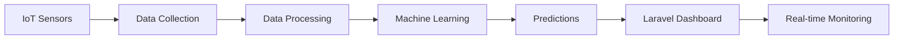

# 👋 Hi there, I'm Harun Ar Rasyid! (@rasiharunart1)

<div align="center">
  


</div>

## 🚀 About Me

Saya adalah seorang **Full-Stack Developer** dan **Data Enthusiast** yang passionate dalam mengintegrasikan teknologi IoT dengan kecerdasan buatan untuk menciptakan solusi inovatif. Dari sensor hingga server, dari data hingga deployment - saya suka membangun sistem end-to-end yang powerful dan scalable.

```python
class HarunAr:
    def __init__(self):
        self.name = "Harun Ar Rasyid"
        self.role = ["IoT Developer", "Data Scientist", "ML Engineer", "Web Developer"]
        self.code = ["Python", "PHP", "JavaScript", "C++", "SQL"]
        self.current_focus = "Building intelligent IoT systems with ML"
        self.fun_fact = "I turn coffee into code ☕➡️💻"
    
    def say_hi(self):
        print("Thanks for dropping by! Let's build something amazing together! 🚀")

me = HarunAr()
me.say_hi()
```

## 💻 Tech Stack

### 🔌 IoT & Embedded Systems


### 📊 Data Science & Machine Learning


### 🌐 Web Development


### 🛠️ Tools & Platforms


## 🎯 What I'm Working On



- 🔭 **Currently building:** Smart IoT systems dengan ML-powered analytics
- 🌱 **Learning:** Deep Learning, Computer Vision, dan Advanced IoT protocols
- 💡 **Exploring:** Edge AI dan TinyML untuk embedded systems
- 📊 **Data Projects:** Recommendation systems, predictive analytics, NLP applications
- 🌐 **Web Apps:** Laravel-based dashboards untuk IoT monitoring & control

## 🏆 Featured Projects

### 📱 Advanced Phone Recommendation System
🔍 Sistem rekomendasi ponsel pintar dengan **TF-IDF** & **Statistical Aggregation**
- Content-based filtering dengan cosine similarity
- 100+ brand support dengan fuzzy matching
- Interactive Gradio web interface
- **Tech:** Python, Scikit-learn, Pandas, Gradio

### 🏠 Smart Home IoT Dashboard
🏡 Monitoring & control sistem rumah pintar berbasis Laravel + ESP32
- Real-time sensor data visualization
- MQTT protocol untuk komunikasi IoT
- Automated control dengan ML predictions
- **Tech:** Laravel, PHP, MySQL, ESP32, MQTT, Chart.js

### 🤖 Predictive Maintenance System
⚙️ ML-powered predictive maintenance untuk peralatan industri
- Sensor data analysis & anomaly detection
- Time series forecasting
- Alert system via web dashboard
- **Tech:** Python, TensorFlow, Flask, Arduino

### 🌾 Agricultural IoT Monitoring
🌱 Smart farming dengan sensor monitoring tanah & cuaca
- Multi-sensor integration (soil moisture, temperature, humidity)
- Weather prediction dengan ML
- Automated irrigation control
- **Tech:** Raspberry Pi, Python, Laravel, MySQL

## 📈 GitHub Stats

<div align="center">
  


</div>

## 🎓 Skills Breakdown

<div align="center">

| Category | Skills | Proficiency |
|----------|--------|-------------|
| **IoT Development** | Arduino, ESP32, Raspberry Pi, MQTT | ████████░░ 80% |
| **Data Science** | Pandas, NumPy, Matplotlib, Seaborn | █████████░ 90% |
| **Machine Learning** | Scikit-learn, TensorFlow, Keras | ████████░░ 80% |
| **Web Development** | Laravel, PHP, JavaScript, MySQL | █████████░ 85% |
| **Version Control** | Git, GitHub | █████████░ 90% |

</div>

## 🌟 Areas of Expertise

<table>
<tr>
<td width="50%">

### 🔌 Internet of Things (IoT)
- Sensor integration & data acquisition
- Microcontroller programming (Arduino, ESP32)
- MQTT & HTTP protocols
- Real-time monitoring systems
- Edge computing

</td>
<td width="50%">

### 📊 Data Science & ML
- Data cleaning & preprocessing
- Exploratory Data Analysis (EDA)
- Feature engineering
- Supervised & unsupervised learning
- Model deployment

</td>
</tr>
<tr>
<td width="50%">

### 🤖 Machine Learning
- Classification & regression
- Clustering & dimensionality reduction
- Natural Language Processing (NLP)
- Recommendation systems
- Time series forecasting

</td>
<td width="50%">

### 🌐 Web Development
- Laravel MVC architecture
- RESTful API development
- Database design & optimization
- Authentication & authorization
- Responsive UI/UX design

</td>
</tr>
</table>

## 🔥 My Development Philosophy

> **"From Sensors to Intelligence"** 🚀

```
1. 📡 Collect: IoT sensors gather real-world data
2. 🔄 Process: Clean and transform raw data
3. 🧠 Learn: Train ML models for insights
4. 📊 Visualize: Laravel dashboards for monitoring
5. ⚡ Automate: Intelligent decision-making systems
```

## 📫 Let's Connect!

<div align="center">

[](https://linkedin.com/in/rasiharun)
[](mailto:rasih.arun@example.com)
[](https://rasiharunart1.github.io)
[](https://twitter.com/rasiharunart1)

</div>

## 💭 Random Dev Quote

<div align="center">


</div>

## 📊 Weekly Development Breakdown

```text
Python       12 hrs 30 mins  ████████████░░░░░░░░░  45%
PHP          8 hrs 15 mins   ████████░░░░░░░░░░░░░  30%
JavaScript   4 hrs 20 mins   ████░░░░░░░░░░░░░░░░░  15%
C++          2 hrs 10 mins   ██░░░░░░░░░░░░░░░░░░░  8%
Other        30 mins         ░░░░░░░░░░░░░░░░░░░░░  2%
```

## 🎯 2025 Goals

- [ ] Deploy 5+ IoT-ML integrated projects
- [ ] Contribute to open-source ML/IoT libraries
- [ ] Master TensorFlow & PyTorch for deep learning
- [ ] Build a comprehensive IoT platform with Laravel
- [ ] Write technical blogs about IoT + ML integration
- [ ] Reach 1000+ GitHub contributions

## 🏅 Achievements

- ✅ Built 10+ IoT systems with ML integration
- ✅ Developed multiple Laravel-based dashboards
- ✅ Created recommendation system with 88% accuracy
- ✅ Implemented real-time sensor monitoring solutions
- ✅ Contributed to data science community projects

---

<div align="center">

### 💡 "The best way to predict the future is to invent it with code!" 


**Thanks for visiting! Feel free to explore my repositories and let's collaborate! 🤝**

⭐ **Star my repos if you find them useful!** ⭐

</div>

---

<div align="center">
  
</div>
